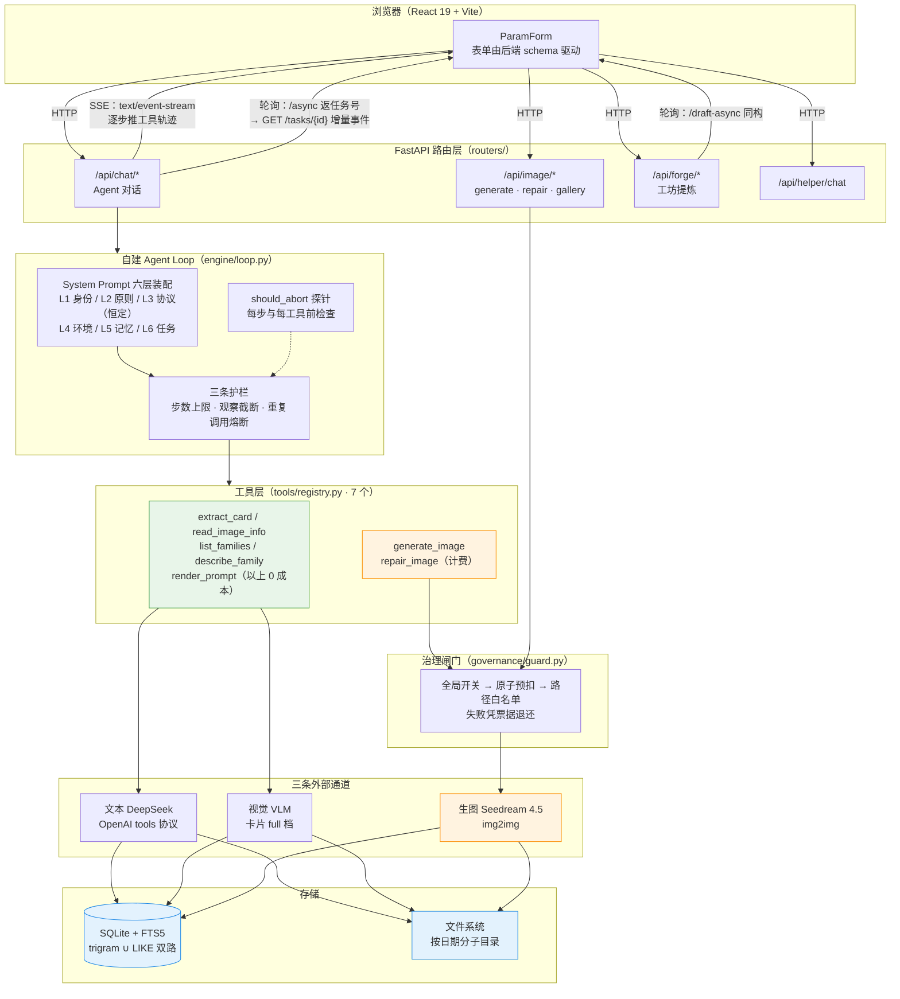

# 换颜 Reskin · 图像创作 Agent

> **一句话**：你给一张真实的旅行照片，它还你一张**还是那张照片**、但换了一种视觉身份的成品。
>
> 第一性原理：**原图保真 + 创意叠加**。不是把照片当灵感重新画一张，而是在
> 「主体 / 构图 / 人物 / 场景完全冻结」的前提下，只叠加风格、材质与创意元素 ——
> Agent 干的是「在真照片上做加法」，不是「重绘」。

---

## 技术栈

| 层 | 选型 | 说明 |
|---|---|---|
| Agent 编排 | **自建 Tool-use Loop**（无框架） | 单图确定性流水线，用不上状态图，见下方「为什么不用 LangGraph」 |
| Web | FastAPI + Uvicorn | 原生 OpenAI tools 协议，不用 LangChain 的抽象 |
| 前端 | React 19 + Vite | 表单由后端 params schema 驱动，前端不认识任何具体家族 |
| 对话模型 | DeepSeek（火山方舟接入点） | function calling / tools 由协议保证结构 |
| 生图模型 | 豆包 Seedream 4.5 | img2img，实测像素下限 3,686,400、档位仅 1k/2k/4k |
| 上下文存储 | **SQLite + FTS5** | 替代被移除的向量库，见下方「中文检索的坑」 |
| 图片 | 本地文件系统，按日期分子目录 | 路径全部由 `__file__` 推导，与启动目录无关 |

### 为什么不用 LangGraph

这个项目要的是一条**不分支、不回溯、不自省**的单图流水线，
而 LangGraph 的价值在于任意拓扑状态图 + 分支回溯 —— 收益为零，
代价是 4 个依赖、版本地狱、`StateGraph` 的状态合并语义，
以及一个从不回收、实测膨胀到 **678MB** 的 SqliteSaver `agent.db`（在 `backend/storage/` 里）。

替换之后依赖从 11 个降到 8 个， Agent 的每一步都变成可见的普通 Python。

### 中文检索的坑（实测结论）

SQLite FTS5 对中文没有一个分词器是够用的，本机 3.53.1 实测：

| 分词器 | `雪山` | `小人国` | `参数` | `插画` | `sunset` |
|---|---|---|---|---|---|
| unicode61 | ✗ | ✗ | ✓ | ✗ | ✓ |
| trigram | ✗ | ✓ | ✗ | ✗ | ✓ |

- `unicode61` 把连续汉字当成一个巨型 token，只有被空格隔开的词才命中
- `trigram` 天然支持子串，但**查询词必须 ≥3 字符**，两字词全灭

所以 `services/context_store.py` 采用 **trigram 索引 ∪ LIKE 兜底的双路并集**。
曾经的坑版本是「先走 FTS、失败了才降级 LIKE」，但两字词查询时 FTS 是
**成功执行且返回 0 行**，根本不触发异常 —— 一个「静默正确」的假象。

---

## 快速启动

```bat
双击 start.bat
```

脚本会自动：探测 Python → 检查 `.env`（没有就从模板复制）→ 装依赖 →
跑一遍家族 YAML 契约自检 → 拉起前后端两个窗口。

- 前端：<http://localhost:5173>
- 后端文档：<http://127.0.0.1:8000/docs>
- 运行全景：`/api/health`（配置就绪度、模板清单、上下文库、治理额度全在里面）

第一次用必须做的事：

```bat
copy .env.example .env
```

然后填 `DEEPSEEK_API_KEY` / `DEEPSEEK_MODEL` / `SEEDREAM_API_KEY` / `SEEDREAM_MODEL`。
**没有 Key 也能玩**：预览、调参、渲染提示词全是 0 成本路径，只有出图才需要 Key。

---

## 架构

```
contracts/     工具契约（Schema）—— Agent 的能力边界写在这里，不散在调用处
tools/         工具实现 —— 只做事，不做权限判断
governance/    治理 —— 预算 / 配额 / 总开关 / 路径白名单
engine/        循环编排 + System Prompt 装配
services/      原子能力（渲染 / 生图 / 上传 / 上下文）
infra/         基础设施（路径 / 日志 / 审计）
routers/       HTTP 层
agents/        门面：把一次请求映射到 engine
```

三条硬规则：**Schema 单源、权限单源、工具失败返回结构化错误而非抛异常**。

### 数据流全景



两条流式路径的取舍：**SSE 适合前台短任务**（工具轨迹可见），
但受云端 60 秒网关限制，所以后台任务走 `POST /async` 立刻返回任务号 +
`GET /tasks/{id}` 轮询增量事件（`forge` 的提炼同构）。
SSE 还有个容易忽略的细节：客户端一关连接，同步 worker 还在跑，
所以 `engine.loop` 接受 `should_abort` 探针，在每一步与每个工具之前检查（见关键设计 7）。

### API 一览

完整交互式文档在 `/docs`（FastAPI 自动生成）。下表是主要端点，
路径与用途**逐条从 `backend/app/routers/*.py` 的 `@router` 装饰器核实**，
路由前缀取自各文件的 `APIRouter(prefix=...)`。

| 端点 | 方法 | 一句话用途 |
|---|---|---|
| `/api/health` | GET | 运行全景：配置就绪度、模板清单、上下文库状态、治理策略（定义在 `main.py`，非 routers） |
| `/api/chat/upload` | POST | 上传参考图，返回会话可用的图片句柄 |
| `/api/chat` | POST | 与 Agent 对话，一次跑完（自建 Tool-use Loop） |
| `/api/chat/stream` | POST | 同上，但用 SSE 逐步推送每一步工具调用 |
| `/api/chat/async` | POST | 后台对话：立刻返回任务号，绕开云端 60 秒网关 |
| `/api/chat/tasks/{task_id}` | GET | 轮询后台对话任务的增量事件 |
| `/api/chat/tasks/{task_id}/cancel` | POST | 中止一个进行中的后台对话 |
| `/api/chat/history` | GET / DELETE | 查看 / 清空某个会话的对话历史 |
| `/api/chat/search` | GET | 在会话历史里做全文检索（SQLite FTS5） |
| `/api/chat/policy` | GET | 查看治理策略与**剩余配额** |
| `/api/chat/reset-quota` | POST | 重置某个会话的生成额度 |
| `/api/image/preview` | POST | 上传图片 + 渲染提示词，**不调生图模型（0 成本）** |
| `/api/image/render` | POST | 已有原图 + 参数 → 渲染提示词（0 成本） |
| `/api/image/generate` | POST | 上传图片 + 生成（**真实计费**，唯一花钱路径） |
| `/api/image/repair` | POST | 局部修复刚生成的图：外科修复，只改指定处 |
| `/api/image/diagnose` | POST | AI 找问题：对比原图与成品，给出漂移候选（最多 3 条） |
| `/api/image/gallery` | GET | 列出最近的图片（按会话隔离 + 公共展示图） |
| `/api/image/gallery/download` | POST | 把选中的图片打包成 zip 下载 |
| `/api/families` | GET | 列出所有创作家族（含完整参数表，即前端表单的 schema） |
| `/api/families/{family_id}` | GET | 查看某个家族的完整参数表 |
| `/api/forge/draft` | POST | 工坊：同步提炼家族草稿（等待完成再返回） |
| `/api/forge/draft-async` | POST | 工坊：后台提炼，立即返回任务 id |
| `/api/forge/tasks/{task_id}` | GET | 轮询后台提炼任务 |
| `/api/forge/{forge_id}/install` | POST | 把一版草稿安装为可用家族 |
| `/api/helper/chat` | POST | 小助手对话（仅限本应用相关问题） |
| `/api/helper/recommend` | POST | 看图推荐适合的风格家族 |
| `/api/auth/me` | GET | 当前会话状态：账号信息 + 访客码 |
| `/api/auth/login` | POST | 登录：账密换会话令牌 |
| `/api/session/restore` | POST | 凭访客码找回会话 |
| `/api/inventory` | GET | 模板目录清单（排障用，含被隔离的坏 YAML 错误） |

> 两处容易记错的路径，以实测为准：
> **上传在 `/api/chat/upload`**（不在 `/api/upload`），
> **配额查询是 `/api/chat/policy`**（没有独立的 `/api/quota` 端点）。
> 另注意 `/api/image/*` 与 `/api/chat/*` 是两个不同前缀 ——
> `generate` 在前者，对话在后者。
> 管理员端点（`/api/admin/*`）未配 `ADMIN_PANEL` 时整体 404，不在默认公开面上。

### 关键设计

**1. 提示词 = 1 骨架 × 6 家族 × N 参数**
19 份提示词收敛成 6 个参数化家族，三段式契约 `preserve / creative / forbid`，
其中 `forbid` 是保真的关键（模型默认会自由发挥）。

**2. params 即 UI schema**
`GET /api/families?full=true` 返回的参数表直接就是前端表单。
**新增一个家族 = 加一个 YAML，前端零改动。**

**3. System Prompt 六层结构，前缀稳定**
实测方舟开了前缀缓存（usage 里有 `cached_tokens`），缓存生效的前提是前缀逐字不变。
所以控制在 L1 身份 / L2 原则 / L3 协议（恒定）之后才放 L4 环境 / L5 记忆 / L6 任务（易变）。

**4. Tool-use Loop 三条护栏**
步数上限、观察长度截断、**重复调用熔断** —— 最后一条最值钱，
LLM 卡在某个错误上原地打转是烧钱最快的方式。

**5. 花钱的路径只有一条，且必须预扣**
`generate_image` 是唯一计费动作，统一在 `governance/guard.py` 过闸：
全局开关 → **原子预扣**（检查与占位在同一把锁内）→ 路径白名单。
失败时**凭票据**退还 —— 没有票据不许退，否则任何人都能用「失败」把别人的账退掉。

**6. 创作卡（card）是全链路的保真枢纽**

```
原图 ──[本地档: Pillow 量化取色]──> palette / 尺寸 / 朝向      （0 成本）
     └─[VLM 档: 视觉模型]────────> subject / anchors / risk_notes
                    ↓
            render_family() 用 card 算「反推 forbid」
                    ↓
      没有 card 时：forbid 只剩模板里写死的通用约束
```

分档的关键是守住「预览 0 成本」的承诺：
`/preview`、`/render` 只跑本地档（拖滑杆不会偷偷产生模型调用），
VLM 档只在真正花钱的 `/generate` 或 Agent 显式调用 `extract_card` 时走。

渲染结果里带 `card_level`（`none` / `palette_only` / `full`）——
「只有色板」和「有主体+锚点」对保真的价值差一个量级，所以告警也分级，
不用「有/没有」的二分去骗人。

**7. 断连即停止**
SSE 场景下客户端一关浏览器，连接就没了，但同步的 worker 还在跑。
`engine.loop` 接受一个 `should_abort` 探针，**在每一步与每个工具之前**检查；
`chat.py` 用 `request.is_disconnected()` 驱动它。
实测：不取消跑 4 次模型调用，取消后 1 次，启动前取消则 **0 次**。

---

## 自测

```bat
cd backend
python tests/run_all.py
```

25 个文件**全部通过**，共 **957 项断言**（另 4 个文件按「通过 N 项」计数，不并入断言口径），全程离线、零真实 API 调用：

| 文件 | 覆盖 | 数量 |
|---|---|---|
| `test_llm_resilience.py` | 通道容错：上游「假装成功」时空响应 → 重试换通道 | 101 |
| `test_api_smoke.py` | HTTP 端到端：健康、家族、上传攻击、路径穿越、注入拦截、坏 YAML 隔离、SSE、审计 | 88 |
| `test_forge.py` | 工坊：草稿提炼、修订、安装为家族、模板库、**参考图越权校验**、阶段预算闸、形状容错 | 148 |
| `test_security.py` | Origin 白名单/重复头、令牌模式、**extract_card 预览降级**、**SSE 断连全链路（1 次 vs 9 次模型调用）**、许可回收 | 57 |
| `test_agent_loop.py` | 正常路径、Schema 校验、重复熔断、步数护栏、观察截断、预览模式、降级、**上下文 token 预算双闸**、护栏常量口径 | 85 |
| `test_renderer.py` | 反推 forbid 两道过滤、占位符三个坑、冲突检测 | 55 |
| `test_identity.py` | 访客码 / 绑定 / 登录、会话隔离、数据库懒建表 | 62 |
| `test_preflight.py` | 编译后漂移自检 + 核心规则按相关性选择 | 60 |
| `test_image_gen.py` | 生图：画幅只三档（表达不了就跟随原图）+ 重试计划 | 46 |
| `test_public_isolation.py` | 公开版隔离：无身份不得列举/写入他人图片 | 42 |
| `test_card.py` | 创作卡提取：色名映射、本地档、三级分级、提示词真的被改变、异常路径、缓存 | 42 |
| `test_concurrency.py` | 线程并发不超卖、损坏的 SQLite 文件、**磁盘满/只读/目录被删**、**多 worker 自检**、上游网络层异常 | 44 |
| `test_governance.py` | 额度预扣/冲正、**票据一次性兑现、崩溃后不泄漏额度**、配额耗尽、会话隔离 | 36 |
| `test_context_store.py` | SQLite 读写、双路召回、分词器迁移、索引自愈、**历史回放的 tools 协议配对** | 40 |
| `test_admin_visibility.py` | 管理员面板：独立身份 + 票据下载 + 软删除（底线：用户仍互相不可见） | 42 |
| `test_image_payload.py` | 回图形态：上游改回 url 也能认（+ 取图 SSRF 两套判据） | 27 |
| `test_error_taxonomy.py` | 错误分诊：网关「假 400」要重试，原文不得直出用户 | 26 |
| `test_repair.py` | repair_image 局部修复：上一版成品为参考图 + CHANGE ONLY 外科指令 | 25 |
| `test_drift.py` | 漂移诊断（repair v1）：解析健壮性 + 降级路径 | 24 |
| `test_async_chat.py` | 后台任务八条护栏（云端 60 秒网关的解法） | 22 |
| `test_repair_http.py` | repair/diagnose HTTP 层：会话隔离 + 落盘结构 + 限速 | 16 |
| `test_mobile_upload.py` | 手机相册 MPO 动态照片 + 出图回填时机 | 14 |
| `test_config_boot.py` | 启动期：安全闸门必须永远能跑完（曾 NameError 崩进程） | 13 |
| `test_helper_doc.py` | 小助手知识索引：新功能问得到 + 单节不被截断 | 13 |
| `test_db_persistence.py` | 数据持久性：WAL 会丢数据 → 必须 DELETE（线上事故固化） | 7 |

> 数法（可自行复核）：`run_all.py` 只信退出码、不解析输出，所以上表是
> **逐个文件单独跑**、数各自打印的通过/失败行得到的，不是估的。
> 注意各文件输出格式不统一（`OK` / `✓` / `✅` 三种都有），
> 且有 7 个文件不打印「结果：N 通过」汇总行。
>
另有一个家族 YAML 契约自检（等价于启动时的 preflight，`start.bat` 第 4 步跑的就是它）：

```bat
cd backend\app
python -c "from services.template_manager import inventory; from tools.registry import missing_implementations; i=inventory(); m=missing_implementations(); print('docs=%d %s' % (i['total'], i['by_kind'])); print('tool contract: %s' % ('OK' if not m else 'MISMATCH %s' % m))"
```

它一次做两件事：数出家族 YAML 文档（坏文件被逐个隔离、计入 `inventory()["errors"]`），
并核对 `contracts/tools.py` 声明的工具名与 `tools/registry.py` 的实现**是否一一对应**
（对不上是极隐蔽的 bug：模型看得见 Schema 会去调，dispatch 里却没有）。

> CI：`.github/workflows/test.yml` 在 push / PR 到 main 时自动跑
> `python backend/tests/run_all.py`，并把全部环境变量自钉为占位值
> （`example.invalid`），**不依赖开发者本机的 `.env`**。

> 测试脚本用 `sys.exit(1)` 报告失败，`run_all.py` 只信退出码、不解析输出字符串。
> 这条看起来是废话 —— 但这里真出过一个 bug：旧 runner 的判定条件
> `"...失败: 0" not in summary.replace("失败","失败")` 是**恒真**的
> （`replace` 两边一样，是个空操作），于是不管多少项失败都打印 PASS。
> 也就是说「绿色」曾经毫无意义。
> 同一个坑在 CI 里也等着：`cmd | tee log` 的退出码取自 `tee`（恒 0），
> 所以 workflow 那步显式声明了 `shell: bash` + `set -o pipefail`。

---

## 一次独立复审发现的真问题（已全部修掉）

项目做完之后请了**两个独立的审查 agent** 分头读代码（安全向 / 架构向），
以下是它们挖出来的、我自己没看到的问题：

| 级别 | 问题 | 后果 |
|---|---|---|
| P0 | **额度可被无限刷**：`refund` 无条件 `-1`，失败退的是**上一次成功**的账 | 「成功+失败」交替 → `used` 永远归零，成本护栏失效 |
| P0 | **自测假绿**：`run_all.py` 判定条件恒真 + 测试脚本不返回退出码 | 整套自测的绿色不可信 |
| P0 | **card 没有生产者**：五个工具里没有 `extract_card`，前端恒传 `{}` | 「反推 forbid」这条核心保真机制 100% 空转，静默产出「提炼原图中的 0 个轮廓」 |
| P0 | **两套家族校验判定相反**：`template_manager` 弱校验放过、`renderer` 强校验拒绝 | 家族能列出能选中，一点渲染就 500 |
| P1 | **SSRF + 无限制下载**：对 Ark 返回的 URL 直接 `requests.get` | 可探测内网、可打满内存（响应体不设上限、`allow_redirects` 默认开） |
| P1 | **上传护栏形同虚设**：先 `read()` 全量进内存再判体积 | 一个 2GB 文件就能把进程打爆，20MB 上限只拦结果不拦过程 |
| P1 | **事件循环冻结**：同步重 IO 直接在 `async def` 里跑 | 一次出图能让 `/api/health` 都超时，前端整页假死 |
| P1 | **提示词注入**：多轮渲染会把参数值里的 `{xxx}` 二次展开 | 用户能在参数里写 `{hard_forbid_joined}`，把 forbid 段搬进 creative，**单方面中和保真约束** |
| P1 | **`lru_cache` 永不失效** + `sync` 不通知进程 | 改完 YAML 同步成功、刷新还是旧提示词，全程无报错 |
| P1 | **一个坏 YAML 拖垮整批**：`load_documents` 遇错直接抛 | 任一家族写坏 → `/api/families`、`/api/health` 全线 500，**六个风格一个都用不了** |
| P2 | 异常详情原样返回前端；download 无体积上限；审计日志无锁无轮转；解压炸弹静默窗口（Pillow 阈值 1~2 倍只发警告）；`dropped_lines` 恒为 0 | 信息泄露 / 磁盘可被打满 / jsonl 被并发写坏 / 0.67GB 内存静默分配 / 诊断数字骗人 |

**修复方式一律是「找到唯一的关口然后收口」**，而不是在各调用点打补丁：

- 额度 → 预扣（`reserve_generation`）+ 凭票据冲正（`release_generation`），
  检查与占位在同一把锁内完成，消除 TOCTOU
- 下载 → `assert_downloadable_url()` 白名单 + 流式体积上限 + 禁重定向
- 上传 → 先看 `Content-Length`、再精确读上限+1 字节，判定统一问 `governance`
- 注入 → `sanitize_value()` 在**渲染前对全部取值**统一剥除裸占位符（只净化一半等于没净化）
- 校验 → 让 `template_manager` 直接调用 `family_renderer.validate_family`，
  同一个 YAML 只有一个裁决者
- 坏文件 → **逐个文件隔离**：跳过坏的、其余照常可用，但把错误收进
  `inventory()["errors"]` 并在启动自检里高调报出（可用性优先，绝不静默掩盖）

---

## 项目结构

```
├── backend/
│   ├── app/
│   │   ├── contracts/     工具契约
│   │   ├── engine/        Tool-use Loop + System Prompt
│   │   ├── tools/         工具实现
│   │   ├── governance/    预算与护栏
│   │   ├── infra/         路径 / 日志 / 审计
│   │   ├── services/      渲染 / 生图 / 上传 / 上下文
│   │   ├── routers/       HTTP
│   │   ├── agents/        门面
│   │   └── templates/     家族 YAML + 风格模板
│   └── tests/             自测（run_all.py，25 个文件 / 957 项断言，全绿）
├── frontend/
│   └── src/               App / ParamForm / api
├── deploy/                打包与清洗脚本（build_release.py / prepare_public.py）
├── .github/workflows/     CI（push/PR 到 main 自动跑全套自测）
├── .env.example
├── LICENSE                非商业许可（NC）
├── start.bat
└── README.md
```

## 进度

- [x] 项目骨架
- [x] 六大家族提示词框架
- [x] 自建 Tool-use Loop（替掉 LangGraph）
- [x] 上下文与长期记忆（SQLite + FTS5，替掉 ChromaDB）
- [x] 治理：配额 / 总开关 / 路径白名单 / 审计
- [x] 参数驱动的动态前端表单
- [x] SSE 实时工具轨迹
- [x] 原图 / 成品对比视图
- [x] 自测套件（25 个文件 / 957 项断言，**全部通过**）
- [x] 独立复审 + 全量修复（5 个 P0、6 个 P1 级问题）
- [x] **创作卡提取**（本地 Pillow 档 + VLM 档）—— 反推 forbid 自此真正生效
- [x] **访问控制**：写操作 Origin 白名单（默认）+ 本地令牌（可选）
- [x] **SSE 资源护栏**：并发上限 + 断连即停止
- [x] 无用文件清理（808MB → 63MB）
- [x] 第二轮独立复审 + 全量修复（2 个 P0、5 个 P1）

## 已知限制

不是「待办」而是**当前设计的边界**，说清楚以免误解：

- **`VISION_MODEL` 不配只能拿到色板**。此时 `card_level=palette_only`，
  渲染器会明确告警，「反推 forbid」降级为模板里的通用约束。
  保真仍在（色板能驱动 `palette_keep` 与 `fidelity=heavy`），但没有主体级约束。
- **令牌是「可选」而不是「默认开」**。默认只监听 `127.0.0.1`，
  风险面已经收在本机；要暴露到局域网请配 `LOCAL_TOKEN`
  （前端配同值的 `VITE_LOCAL_TOKEN`）。
- **Origin 闸只拦浏览器**。本地进程（curl / 脚本）不带 Origin，一律放行 ——
  这是有意的：本地进程本来就有全部权限，拦它没有意义。
- **`should_abort` 的粒度是「步」而不是「请求」**。
  已经发出的那次 LLM / 生图调用收不回来，能保证的是不再发起下一步。
